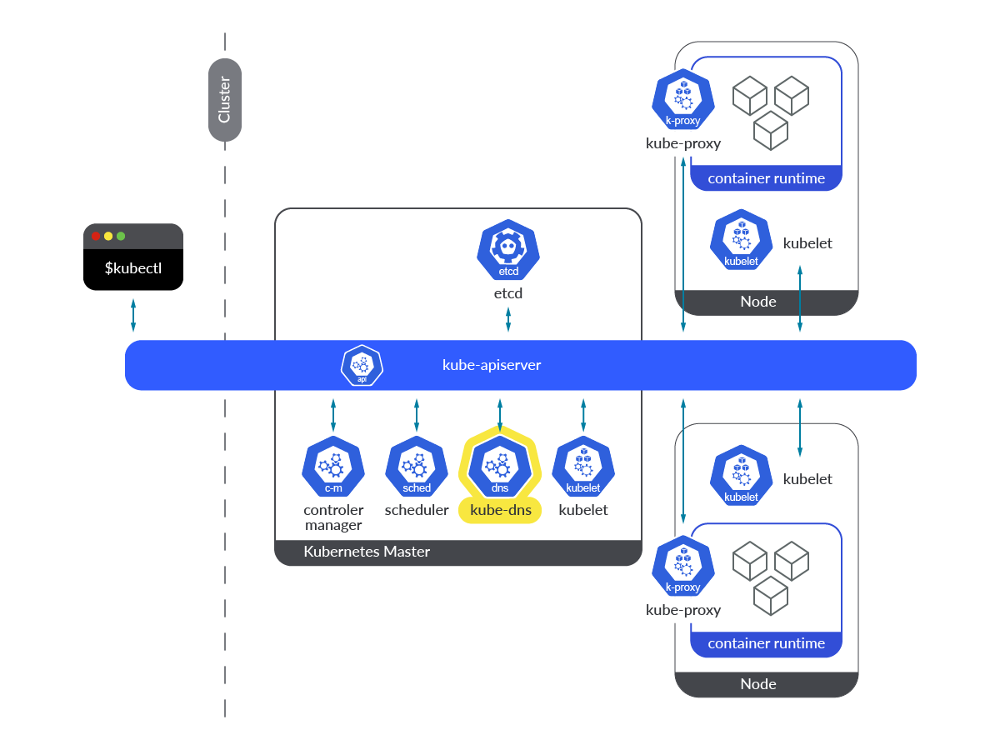

# How to Running Minikube

## Getting Started
This is How to running minikube in this node [^1]\
Running this command \
`curl -LO https://storage.googleapis.com/minikube/releases/latest/minikube-linux-amd64`\
`sudo install minikube-linux-amd64 /usr/local/bin/minikube`

After install minikube in system, check with command\
`minikube version`

Create New Profile Cluster with Docker Driver, this will create cluster with default Resources : 2 CPU and 2200MB RAM\
`minikube start --driver=docker`

Check current running cluster with `kubectl` command, if you not already install , then use this command\
`snap install kubectl`

Use this command to check cluster already running some pods \
`kubectl get pods -A`

If your result is like this image, then kubernetes already running with some components
```
root@13-07-shopee-230713SKSNQWA2-linux:~/dev-project/system/minikube# kubectl get pods -A
NAMESPACE     NAME                               READY   STATUS    RESTARTS        AGE
kube-system   coredns-787d4945fb-t5vgp           1/1     Running   0               2m56s
kube-system   etcd-minikube                      1/1     Running   0               3m8s
kube-system   kube-apiserver-minikube            1/1     Running   0               3m7s
kube-system   kube-controller-manager-minikube   1/1     Running   0               3m8s
kube-system   kube-proxy-h44d8                   1/1     Running   0               2m56s
kube-system   kube-scheduler-minikube            1/1     Running   0               3m8s
kube-system   storage-provisioner                1/1     Running   1 (2m25s ago)   3m6s
```

And if you check on node list, you can get one node only running this kubernetes cluster
```
root@13-07-shopee-230713SKSNQWA2-linux:~/dev-project/system/minikube# kubectl get node
NAME       STATUS   ROLES           AGE     VERSION
minikube   Ready    control-plane   8m27s   v1.26.3
root@13-07-shopee-230713SKSNQWA2-linux:~/dev-project/system/minikube# 
```

## Running Multi-Node Cluster
**To Running in multi Node Cluster** You need custom options on `minikube start` command [^2]

1. Create new Profile Minikube and create multi node\
`minikube start --nodes 2 -p multinode-demo`

2. To check List of profile minikube running use command\
`minikube profile list`\
3. You will get two profile with different clusters
```
root@13-07-shopee-230713SKSNQWA2-linux:~/dev-project/system/minikube# minikube profile list
|----------------|-----------|---------|--------------|------|---------|---------|-------|--------|
|    Profile     | VM Driver | Runtime |      IP      | Port | Version | Status  | Nodes | Active |
|----------------|-----------|---------|--------------|------|---------|---------|-------|--------|
| minikube       | docker    | docker  | 192.168.49.2 | 8443 | v1.26.3 | Running |     1 | *      |
| multinode-demo | docker    | docker  | 192.168.58.2 | 8443 | v1.26.3 | Running |     2 |        |
|----------------|-----------|---------|--------------|------|---------|---------|-------|--------|
```
4. Now point your **kubectl Context** to use new profile you created before\
`kubectl config use-context multinode-demo`

5. Then check list of nodes running for cluster multinode-demo\
`kubectl get node`

6. Now you get two nodes, one as **control-plane node**, and another one as **worker node**
```
root@13-07-shopee-230713SKSNQWA2-linux:~/dev-project/system/minikube# kubectl get node
NAME                 STATUS   ROLES           AGE     VERSION
multinode-demo       Ready    control-plane   7m      v1.26.3
multinode-demo-m02   Ready    <none>          6m34s   v1.26.3
```

## Get Deep into the Cluster
We will get in Deep the cluster, we can start to inspect the Control Plane Node\\

1. Use this command to describe detail of a node\
`kubectl describe node multinode-demo`
2. You can see some **Pods** running in this control plane
```
Non-terminated Pods:          (8 in total)
  Namespace                   Name                                      CPU Requests  CPU Limits  Memory Requests  Memory Limits  Age
  ---------                   ----                                      ------------  ----------  ---------------  -------------  ---
  kube-system                 coredns-787d4945fb-9mkdl                  100m (2%)     0 (0%)      70Mi (0%)        170Mi (2%)     13m
  kube-system                 etcd-multinode-demo                       100m (2%)     0 (0%)      100Mi (1%)       0 (0%)         13m
  kube-system                 kindnet-9hhrm                             100m (2%)     100m (2%)   50Mi (0%)        50Mi (0%)      13m
  kube-system                 kube-apiserver-multinode-demo             250m (6%)     0 (0%)      0 (0%)           0 (0%)         13m
  kube-system                 kube-controller-manager-multinode-demo    200m (5%)     0 (0%)      0 (0%)           0 (0%)         13m
  kube-system                 kube-proxy-q47ml                          0 (0%)        0 (0%)      0 (0%)           0 (0%)         13m
  kube-system                 kube-scheduler-multinode-demo             100m (2%)     0 (0%)      0 (0%)           0 (0%)         13m
  kube-system                 storage-provisioner                       0 (0%)        0 (0%)      0 (0%)           0 (0%)         13m
  ```
  Simple Description every pods running in is : 
  - coredns : CoreDNS is a flexible, extensible DNS server that can serve as the Kubernetes cluster DNS. this component replace existing **kube-dns** component in kubernetes. [^3]
  - etcd : ETCD is key-value stores database, to save Kubernetes configuration data, state, and metadata. [^4]
  - **(Optional, only when running KinD)** kindnet: Kindnet is Simple CNI Plugin with IPV4, IPV6 and DualStack Support to running Kubernetes clusters in Docker. [^5]
  - kube-apiserver: The Kubernetes API server validates and configures data for the api objects which include pods, services, replicationcontrollers, and others. The API Server running in REST Schema [^6]
  - kube-controller-manager: The Kubernetes controller manager is a daemon that embeds the core control loops shipped with Kubernetes. In Kubernetes, a controller is a control loop that watches the shared state of the cluster through the apiserver and makes changes attempting to move the current state towards the desired state. Examples of controllers that ship with Kubernetes today are the replication controller, endpoints controller, namespace controller, and serviceaccounts controller. [^7]
  - kube-proxy : The Kubernetes network proxy runs on each node. This reflects services as defined in the Kubernetes API on each node and can do simple TCP, UDP, and SCTP stream forwarding or round robin TCP, UDP, and SCTP forwarding across a set of backends. [^8]
  - kube-scheduler : The Kubernetes scheduler is a control plane process which assigns Pods to Nodes. The scheduler determines which Nodes are valid placements for each Pod in the scheduling queue according to constraints and available resources. [^9]
  - **(Optional, only in minikube)** storage-provisioner : Storage Provisioner Controller make easy provision storage in minikube cluster, you can emulate PersistentVolume object to create data storage mapping for your service. [^10]\
  \
And Another Component **Must Be** exist in every node running kubernetes is **Kubelet**, The kubelet is the primary "node agent" that runs on each node. It can register the node with the apiserver using one of: the hostname; a flag to override the hostname; or specific logic for a cloud provider. [^11]

## Architecture diagram for Kubernetes
This is minimum architecture for Kubenetes

Source image : https://sysdig.com/blog/how-to-monitor-coredns/

## References
[^1]: [Get Started Installing Minikube](https://minikube.sigs.k8s.io/docs/start/)\
[^2]: [Using Multi-Node Clusters minikube](https://minikube.sigs.k8s.io/docs/tutorials/multi_node/)\
[^3]: [What is CoreDNS Kubernetes](https://kubernetes.io/docs/tasks/administer-cluster/coredns/#about-coredns)\
[^4]: [How Does Kubernetes Use etcd?](https://matthewpalmer.net/kubernetes-app-developer/articles/how-does-kubernetes-use-etcd.html)\
[^5]: [KINDNet : Simple CNI plugin with IPv4, IPv6 and DualStack support](https://github.com/aojea/kindnet)\
[^6]: [kube-apiserver](https://kubernetes.io/docs/reference/command-line-tools-reference/kube-apiserver/#synopsis)\
[^7]: [kube-controller-manager](https://kubernetes.io/docs/reference/command-line-tools-reference/kube-controller-manager/#synopsis)\
[^8]: [kube-proxy](https://kubernetes.io/docs/reference/command-line-tools-reference/kube-proxy/#synopsis)\
[^9]: [kube-scheduler](https://kubernetes.io/docs/reference/command-line-tools-reference/kube-scheduler/#synopsis)\
[^10]: [Dynamic provisioning and CSI in Minikube](https://minikube.sigs.k8s.io/docs/handbook/persistent_volumes/#dynamic-provisioning-and-csi)\
[^11]: [kubelet](https://kubernetes.io/docs/reference/command-line-tools-reference/kubelet/#synopsis)


